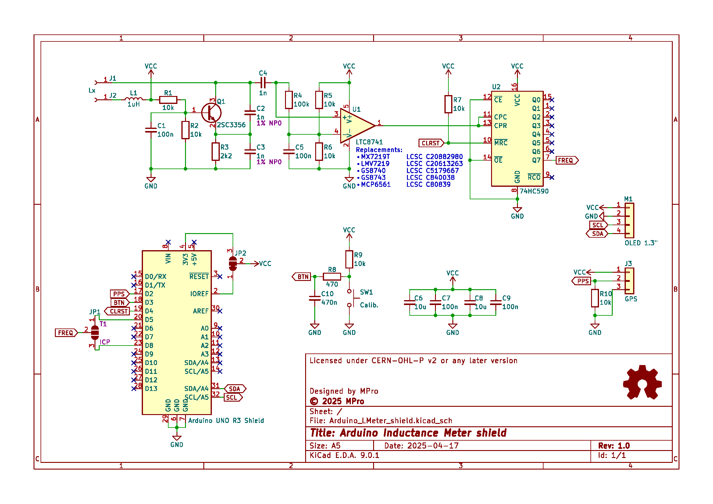
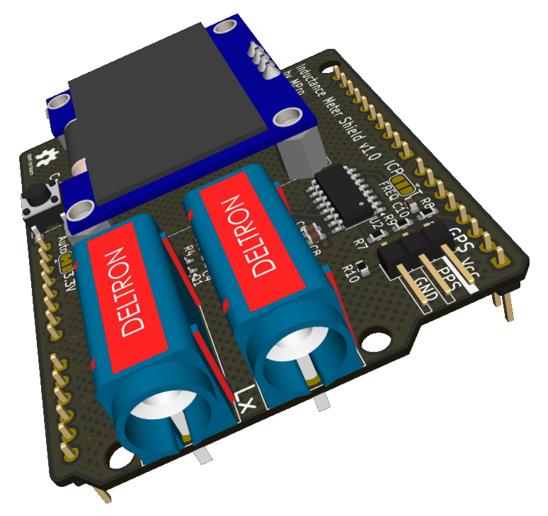

# **Arduino UNO Inductance Measurement Shield**

- [**Arduino UNO Inductance Measurement Shield**](#arduino-uno-inductance-measurement-shield)
  - [**Overview**](#overview)
  - [**Applications**](#applications)
  - [**Hardware**](#hardware)
    - [**Design Architecture**](#design-architecture)
    - [**Signal Conditioning**](#signal-conditioning)
    - [**Integrated Display**](#integrated-display)
    - [**Assembly**](#assembly)
    - [**Schematic diagram**](#schematic-diagram)
    - [**Module visualisation**](#module-visualisation)
    - [**Production files**](#production-files)
  - [**Software**](#software)
  - [**Reporting bugs**](#reporting-bugs)
  - [**License**](#license)
    - [**Hardware**](#hardware-1)
    - [**Software**](#software-1)
  - [**Support**](#support)

---

## **Overview**
The Arduino UNO Inductance Measurement Shield is a dedicated peripheral board designed to enable precise inductance measurements, a functionality absent in most conventional digital multimeters (DMMs). While specialized LCR meters offer inductance measurement, they typically lack broader capabilities such as voltage or current measurement. This shield addresses this gap by providing a compact, integrated solution for inductance quantification via frequency-domain analysis.

---

## **Applications**

* Rapid inductance measurement for prototyping, education, or field diagnostics.
* Integration with automated test systems leveraging Arduino’s serial capabilities.

---

## **Hardware**
  ### **Design Architecture**
  The shield employs a [**Colpitts oscillator topology**](http://en.wikipedia.org/wiki/Colpitts_oscillator) modified to exclude the inductor. The unknown inductor (<em>Lx</em>​) is connected externally via test leads, completing the resonant circuit. 
  Key design elements include:

  * Resonant Circuit:
    * Two series-connected 1 nF capacitors (<em>C1=C2=</em>1 nF) form the known capacitance (<em>Ctotal</em>=0.5 nF).
    * A fixed 1 µH reference inductor (<em>Lref</em>​) is integrated on-board, connected in series with Lx​.
  * Frequency Limitation:
    * <em>Lref</em>​ ensures oscillation continuity when test leads are short-circuited.
    * It imposes an upper frequency limit, ensuring compatibility with downstream circuitry.
    * Theoretical maximum resonant frequency: fmax≈7.1 MHz 
      calculated via: 
      &nbsp;&nbsp;&nbsp;&nbsp;&nbsp;&nbsp;&nbsp;&nbsp;&nbsp;&nbsp;&nbsp;&nbsp;&nbsp;&nbsp;&nbsp;&nbsp;
      &nbsp;&nbsp;&nbsp;&nbsp;&nbsp;&nbsp;&nbsp;&nbsp;&nbsp;&nbsp;&nbsp;&nbsp;&nbsp;&nbsp;&nbsp;&nbsp;
      $\large f=\frac{1}{2\pi\sqrt{L_{ref}C_{total}}}$

  ### **Signal Conditioning**

  * Comparator Stage:
    * An Analog Devices LTC8741 (or replacement) high-speed comparator converts the oscillator’s sinusoidal output to a square wave.
    * Critical specification: Propagation delay ≤ 80 ns, ensuring signal integrity up to 7.2 MHz.
  * Frequency Division:
    * A 74HC590 8-bit binary counter divides the oscillator output by 256.
    * Output frequency range: 0 Hz to 27.7 kHz (theoretical, 7.2 MHz/256).
    * Enables reliable measurement by the Arduino UNO’s 16 MHz microcontroller.
  * A pushbutton with hardware debouncing (RC low-pass filter with a time constant of 4.9 ms).

  ### **Integrated Display**

  An on-shield OLED displays measured inductance values in real time, eliminating external monitoring requirements.

  ### **Assembly**
  For Arduino UNO:
  * JP1 jumper – short-circuit (with a drop of tin) the FREQ and ICP fields.
  * JP2 jumper – leave in the Auto position (Vcc from IOREF).

  ### **Schematic diagram**
  

  ### **Module visualisation**
  (click on the image to see the 3D model)
  

  ### **Production files**
  The production files can be found in the location: https://github.com/michpro/Arduino_LMeter_shield/blob/master/production/

---

## **Software**
The software was developed in the Arduino environment ([Source](https://github.com/michpro/Arduino_LMeter_shield/blob/master/LMeter/)). 
The running program can be in one of four defined states:
- ST_IDLE:
  * no operations are performed,
- ST_MEASURE:
  * The Arduino calculates inductance using the resonant frequency (<em>f</em>) via the formula: 
    &nbsp;&nbsp;&nbsp;&nbsp;&nbsp;&nbsp;&nbsp;&nbsp;&nbsp;&nbsp;&nbsp;&nbsp;&nbsp;&nbsp;&nbsp;&nbsp;
    &nbsp;&nbsp;&nbsp;&nbsp;&nbsp;&nbsp;&nbsp;&nbsp;&nbsp;&nbsp;&nbsp;&nbsp;&nbsp;&nbsp;&nbsp;&nbsp;
    $\Large L_{x}=\frac{1}{(2\pi f)^2\cdot C_{total}}-L_{ref}$

    Process Flow:

      * Arduino measures the frequency at the 74HC590 output.
      * Multiplies by 256 to reconstruct the original oscillator frequency.
      * Computes <em>Lx</em>​ using the known <em>Ctotal</em>​ and <em>Lref</em>​.
  * Displays the calculated <em>Lx</em> value on the OLED display.
  * If the measuring terminals are short-circuited without any additional inductance, pressing the ‘Calib’ button will cause the measured inductance value to be used to compensate for subsequent measurements (zeroing).
- ST_NO_INDUCT:
  * No inductance is connected to the measuring terminals - they remain open and the generator does not oscillate. Information about this state is displayed on the display together with the measurement inductance correction.
- ST_FCPU_CALIB:
  * After connecting a stable PPS signal from the GPS module, the program proceeds to the calibration procedure for the clock frequency of the Atmega328p chip in the Arduino module. This procedure takes 240 seconds. After this time (provided there were no interruptions in the PPS signal), the actual clock frequency of the Arduino module processor is calculated. This value is stored in the internal EEPROM memory and is used for calculations during subsequent meter starts. If, for any reason, the user wants to restore the default value of 16MHz for Arduino UNO, the ‘Calib’ button must be held down during module start-up/reset.

---

## **Reporting bugs**

[Create an issue on GitHub](https://github.com/michpro/Arduino_LMeter_shield/issues).

---

## **License**
Copyright © 2025 Michal Protasowicki

### **Hardware**
  * Source: https://github.com/michpro/Arduino_LMeter_shield

    Hardware part of this project is released under CERN Open Hardware Licence Version 2 - Permissive.

    

### **Software**
  * Source: [https://github.com/michpro/Arduino_LMeter_shield/LMeter](https://github.com/michpro/Arduino_LMeter_shield/blob/master/LMeter/)

    Software part of this project is released under MIT Licence.

    

---

## **Support**
If You find my projects interesting and You wanted to support my work, You can give me a cup of coffee or a keg of beer :)

&nbsp;&nbsp;&nbsp;&nbsp;&nbsp;&nbsp;&nbsp;&nbsp;&nbsp;&nbsp;
